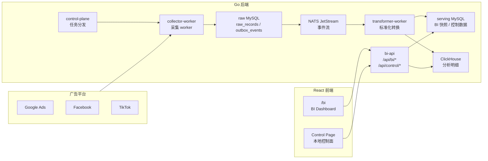
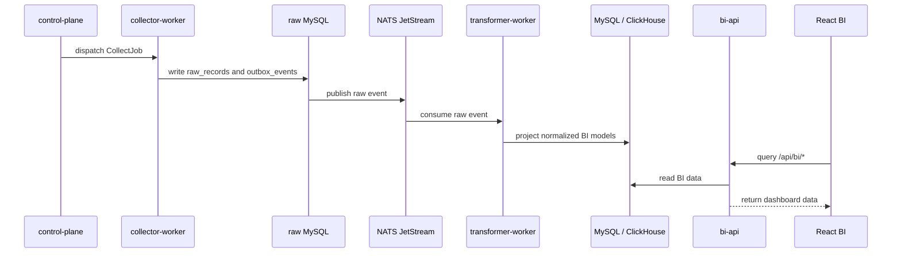

# be-ads-project

面向广告投放数据的本地采集、转换、分析和 BI 展示系统。

系统按广告平台账号组织采集任务，写入 raw 数据，经过标准化转换后投影到查询存储，最后通过 BI API 和 React 页面提供报表分析能力。项目同时提供一套本地运维控制面，方便在开发环境启动、停止、查看和验收整条链路。

## 核心能力

- 多平台广告数据采集骨架：Google Ads、Facebook、TikTok
- raw 数据落库和 outbox 事件发布
- raw event 标准化转换
- MySQL / ClickHouse 查询投影
- BI 查询接口：账号、Campaign、Insight、Search Term、UA、素材质量等
- React BI 页面：Overview、Breakdown、Creatives、Quality、Control
- 本地控制面：启动、停止、状态查看、worker 控制、DLQ 可视化
- Mac 本地新环境一键启动和验收

## 技术选型

| 层 | 技术 | 用途 |
| --- | --- | --- |
| 后端语言 | Go | 服务入口、采集、转换、BI API |
| 后端框架 | Kratos | HTTP 服务生命周期、日志、恢复和访问日志 |
| 前端 | React + Vite + TypeScript | BI 页面和本地控制面 |
| OLTP 存储 | MySQL | raw 数据、outbox、BI 快照和控制数据 |
| OLAP 存储 | ClickHouse | Insight / UA 等分析查询 |
| 消息系统 | NATS JetStream | 采集事件和转换事件 |
| CDC | Debezium | outbox 到消息流的可选联调路径 |
| 本地环境 | Docker Desktop | MySQL、ClickHouse、NATS 等依赖 |
| 开发入口 | Makefile + shell scripts | 本地启动、停止、验证 |
| SDD | OpenSpec + Spec Kit | 需求、方案、任务和长期约束 |

## 系统架构



## 数据流



## 目录结构

```text
be_ads_project/
  be/                  Go 后端工程
    cmd/               bi-api、collector-worker、transformer-worker、control-plane
    internal/          业务模块和基础设施适配
    scripts/           本地启动、停止、验证脚本
    deploy/            部署和观测配置
    openspec/          后端轻量 SDD
    specs/             后端 Spec Kit SDD

  fe/                  React BI 前端工程
    src/               页面、组件、API client、工具函数
    openspec/          前端轻量 SDD
    specs/             前端 Spec Kit SDD
```

## 快速开始

### Mac 新环境

```bash
git clone git@github.com:nameless422/be-ads-project.git
cd be-ads-project/be
make mac-start
```

`make mac-start` 会检查 Xcode Command Line Tools、Homebrew、Go、Node.js、Docker Desktop 和本地端口；缺少 Go、Node.js 或 Docker Desktop 时会尝试通过 Homebrew 安装；随后安装前端依赖、启动本地栈并执行验收。

启动成功后访问：

```text
http://127.0.0.1:8080/
http://127.0.0.1:8080/bi
```

### 日常开发

```bash
cd be
make up
make verify
make status
make down
```

前端单独开发：

```bash
cd fe
npm install
npm run dev
```

## 常用命令

```bash
cd be
make help              # 查看所有命令
make mac-start         # Mac 新环境一键启动
make up                # 启动 MySQL / ClickHouse / NATS 和 4 个后端服务
make verify            # 验收本地主链路
make status            # 查看服务状态和最近日志
make down              # 停止本地栈
make test              # 执行 go test ./...
make frontend-build    # 构建 React 前端
```

## API 和页面

主要页面：

```text
/bi
/bi/overview
/bi/breakdown
/bi/creatives
/bi/quality
/bi/control
```

主要 API：

```text
GET  /healthz
GET  /api/bi/snapshots
GET  /api/bi/campaigns
GET  /api/bi/insights/summary
GET  /api/bi/insights/detail
GET  /api/bi/campaign-diagnostics
GET  /api/bi/search-terms
GET  /api/bi/ua-report
GET  /api/bi/ua-fields
GET  /api/bi/game-kpis
POST /api/bi/game-kpis
GET  /api/control/overview
GET  /api/control/dlq
GET  /api/control/local-stack
POST /api/control/local-stack/*
```

## SDD 文档

项目同时使用轻量 OpenSpec 和重流程 Spec Kit：

```text
be/openspec   后端 OpenSpec
be/specs      后端 Spec Kit
fe/openspec   前端 OpenSpec
fe/specs      前端 Spec Kit
```

建议用法：

- 小功能、局部改动：OpenSpec
- 跨模块重构、API/数据链路变化：Spec Kit
- 临时排查和一次性修复：直接对话或 issue 记录

## 更多说明

- [后端说明](be/README.md)
- [前端说明](fe/README.md)
- [Mac 本地启动脚本](be/scripts/ops/mac_local_start.sh)
