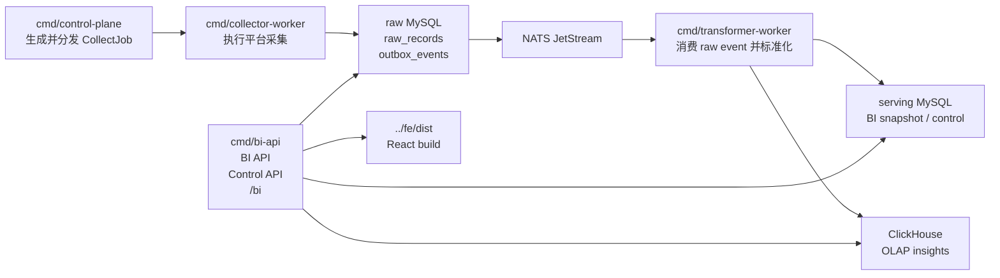

# be

Go 后端工程，负责广告数据采集、转换、BI 查询、本地控制面 API，以及生产环境下 `/bi` React 页面静态资源托管。

## 后端职责

- 生成并分发采集任务
- 拉取广告平台数据并写入 raw 存储
- 发布 raw outbox 事件
- 消费事件并转换成标准 BI 模型
- 投影到 MySQL / ClickHouse 查询存储
- 提供 `/api/bi/*` BI 查询接口
- 提供 `/api/control/*` 本地控制和排障接口
- 托管 `../fe/dist` 下的 React 页面

## 技术栈

| 类型 | 技术 | 说明 |
| --- | --- | --- |
| 语言 | Go | 后端服务和本地工具 |
| HTTP runtime | Kratos | 服务生命周期、恢复、日志、超时 |
| OLTP | MySQL | raw、outbox、BI 快照、控制面数据 |
| OLAP | ClickHouse | Insight / UA 等分析明细 |
| 消息 | NATS JetStream | raw event 到转换 worker |
| CDC | Debezium | outbox 联调路径 |
| 本地依赖 | Docker Desktop | MySQL、ClickHouse、NATS 容器 |
| 前端托管 | `net/http` static serving | `/bi` 读取 `../fe/dist` |

## 服务架构



## 目录说明

```text
cmd/
  bi-api/                 BI API、控制 API、React 静态资源托管
  collector-worker/       广告平台采集 worker
  transformer-worker/     raw event 转换 worker
  control-plane/          采集任务调度和分发
  google_oauth_bootstrap/ Google Ads OAuth 辅助入口
  raw-retention/          raw 数据保留期工具
  replay-dlq/             DLQ 重放工具

internal/
  modules/
    collection/           采集目标、connector、raw store、outbox
    transformation/       标准化、投影 fanout、worker 消费
    reporting/            BI read model、查询仓储、HTTP API、本地控制
    controlplane/         任务构建、分片、lease / dispatch
  platform/               MySQL、ClickHouse、Kratos 适配
  shared/                 跨模块广告模型和消息模型
  config/                 环境变量配置
  logx/                   日志初始化
  mock/                   本地 seeded 数据

scripts/
  dev/                    本地依赖服务
  ops/                    启动、停止、状态、Mac 一键启动
  verify/                 本地主链路和 Debezium 验收
```

## 模块边界

| 模块 | 负责 | 不负责 |
| --- | --- | --- |
| `collection` | sync target、connector 调用、raw 写入、outbox 发布 | BI 查询和页面展示 |
| `transformation` | raw event 消费、平台字段标准化、投影 fanout | 任务调度和 HTTP API |
| `reporting` | BI 查询模型、HTTP API、控制面、本地 ops 调用 | 平台 connector 实现 |
| `controlplane` | 任务分发、分片和 worker assignment | 实际采集和转换逻辑 |
| `shared` | 广告通用模型、消息模型 | 业务流程编排 |

## 快速启动

Mac 新环境：

```bash
make mac-start
```

日常本地开发：

```bash
make up
make verify
make status
make down
```

前端构建也可以从后端目录触发：

```bash
make frontend-build
```

## 命令说明

| 命令 | 作用 |
| --- | --- |
| `make mac-start` | Mac 新环境检查、依赖安装、启动、验收 |
| `make up` | 启动 MySQL / ClickHouse / NATS 和 4 个后端服务 |
| `make start` | 只启动后端 4 个服务 |
| `make stop` | 停止后端 4 个服务 |
| `make down` | 停止后端服务并移除本地依赖容器 |
| `make status` | 查看进程、端口和最近日志 |
| `make verify` | 验收本地主链路 |
| `make verify-debezium` | 验收 Debezium outbox 链路 |
| `make test` | 执行 `go test ./...` |
| `make clean` | 删除 `logs/`、`run/`、`tmp/` |

## 本地依赖

`make up` 会启动这些容器：

| 容器 | 端口 | 用途 |
| --- | --- | --- |
| `be-ads-raw-mysql` | `3307` | raw_records / outbox_events |
| `be-ads-serving-mysql` | `3308` | BI 快照、控制面数据 |
| `be-ads-clickhouse` | `8123` / `9000` | OLAP 查询 |
| `be-ads-nats` | `4222` / `8222` | JetStream 消息流 |

## API

健康检查：

```text
GET /healthz
```

BI 查询：

```text
GET  /api/bi/snapshots
GET  /api/bi/campaigns
GET  /api/bi/insights/summary
GET  /api/bi/insights/detail
GET  /api/bi/campaign-diagnostics
GET  /api/bi/search-terms
GET  /api/bi/ua-report
GET  /api/bi/ua-fields
GET  /api/bi/game-kpis
POST /api/bi/game-kpis
```

控制面：

```text
GET  /api/control/overview
GET  /api/control/leases
GET  /api/control/shards
GET  /api/control/dlq
POST /api/control/dlq/replay
POST /api/control/backfill
GET  /api/control/local-stack
POST /api/control/local-stack/start
POST /api/control/local-stack/stop
POST /api/control/local-stack/restart
POST /api/control/local-stack/verify
POST /api/control/local-stack/start-infra
POST /api/control/local-stack/stop-infra
POST /api/control/local-stack/start-workers
POST /api/control/local-stack/stop-workers
POST /api/control/local-stack/restart-collector
POST /api/control/local-stack/add-worker
POST /api/control/local-stack/remove-worker
```

页面托管：

```text
GET /bi
GET /bi/*
```

## 配置

配置主要来自环境变量，示例文件在：

```text
.env.stack.example
.env.storage.example
.env.google-ads.example
```

本地默认使用 seeded / mock 数据即可跑通主链路。真实平台账号接入时，再按对应平台补充凭证。

## 运行产物

```text
logs/    服务日志和 startup.log
run/     编译后的本地二进制和 pid 文件
tmp/     临时文件
```

这些目录是运行产物，不需要提交。

## 验证策略

普通后端改动：

```bash
go test ./...
```

影响 API、存储、worker 或本地启动：

```bash
make up
make verify
make down
```

影响 Debezium：

```bash
make debezium-up
make verify-debezium
make debezium-down
```

## SDD

后端同时保留两套 SDD：

```text
openspec/   轻量变更说明，适合局部功能和 API 调整
specs/      Spec Kit 风格文档，适合重构、跨模块和数据链路变化
.specify/   项目长期约束
```

建议先读：

```text
openspec/project.md
openspec/specs/backend-runtime/spec.md
openspec/specs/bi-api/spec.md
openspec/specs/data-pipeline/spec.md
```

## 常见排查

- `make status` 显示 `stale pid file`：先执行 `make clean`，再重新 `make up`。
- 端口被占用：检查 `8080`、`3307`、`3308`、`8123`、`9000`、`4222`、`8222`。
- `/bi` 返回前端未构建：执行 `make frontend-build`。
- Docker 容器异常：执行 `make down` 后重新 `make up`。
