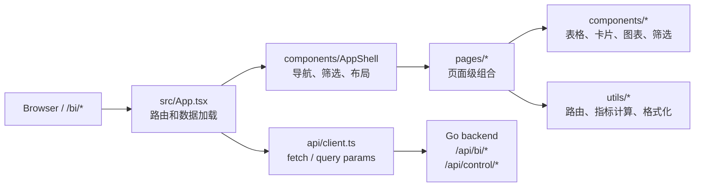
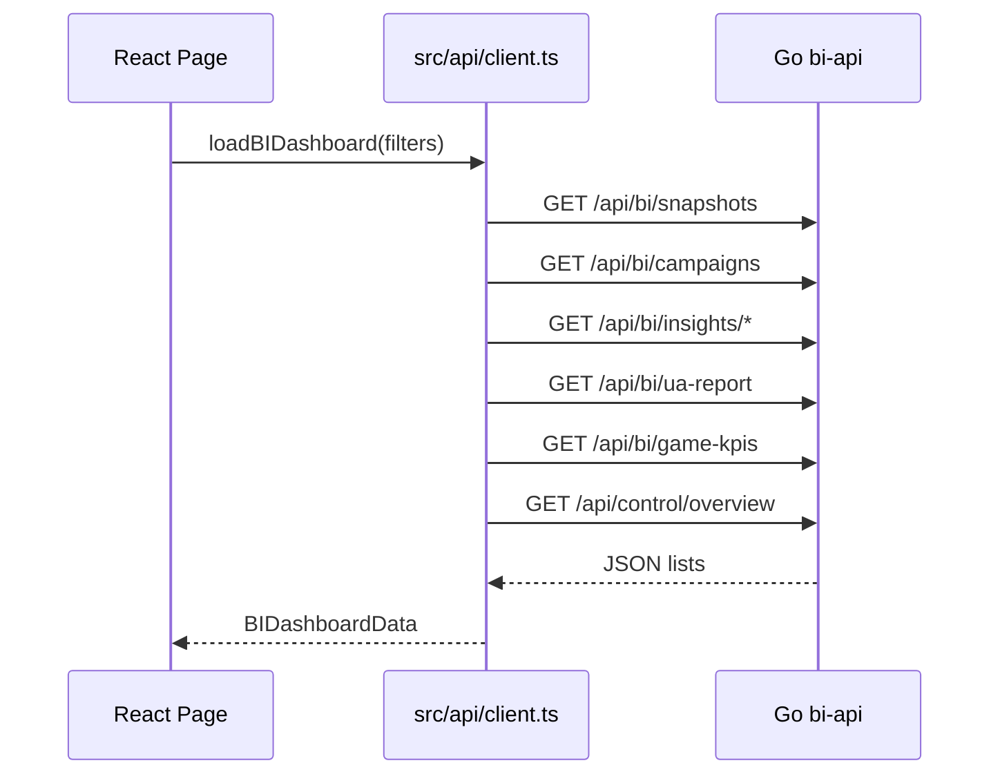

# fe

React + Vite + TypeScript 前端工程，负责 BI Dashboard 和本地控制面页面。

生产访问由后端 `be/cmd/bi-api` 提供的 `/bi` 入口联调：

```text
http://127.0.0.1:8080/bi
```

开发时可以直接启动 Vite：

```bash
npm install
npm run dev
```

## 技术栈

| 类型 | 技术 | 说明 |
| --- | --- | --- |
| UI runtime | React | 页面和组件 |
| 构建工具 | Vite | 本地开发和生产构建 |
| 语言 | TypeScript | API 类型和组件类型约束 |
| 图标 | lucide-react | 控制按钮和状态图标 |
| 样式 | CSS | 目前使用 `src/styles.css` 统一管理 |
| 数据来源 | Go backend | `/api/bi/*` 和 `/api/control/*` |

## 页面

| 路由 | 文件 | 说明 |
| --- | --- | --- |
| `/bi` | `src/App.tsx` | 默认进入 Overview |
| `/bi/overview` | `src/pages/OverviewPage.tsx` | 总览、账号快照、趋势和核心 KPI |
| `/bi/breakdown` | `src/pages/BreakdownPage.tsx` | Campaign / Insight 明细拆解 |
| `/bi/creatives` | `src/pages/CreativesPage.tsx` | 素材、创意和 game KPI 视角 |
| `/bi/quality` | `src/pages/QualityPage.tsx` | 字段质量、诊断和数据完整性 |
| `/bi/control` | `src/pages/ControlPage.tsx` | 本地栈控制、DLQ、worker 操作 |

## 前端架构



## 目录说明

```text
src/
  api/
    client.ts       API 请求和 query 参数构造
    types.ts        后端响应类型、页面数据类型
  components/
    AppShell.tsx    页面外壳、导航和筛选区域
    Charts.tsx      轻量趋势图
    DataTable.tsx   通用表格
    Filters.tsx     平台、账号、日期、维度筛选
    KpiCard.tsx     KPI 指标卡
  pages/
    OverviewPage.tsx
    BreakdownPage.tsx
    CreativesPage.tsx
    QualityPage.tsx
    ControlPage.tsx
  utils/
    metrics.ts      指标计算、格式化、字段质量统计
    routing.ts      页面路由和默认筛选
  App.tsx           应用入口、数据加载和页面选择
  main.tsx          React mount
  styles.css        全局样式
```

## 数据流



## API 契约

主数据加载集中在 `src/api/client.ts`：

```text
loadBIDashboard(filters)
  -> /api/bi/snapshots
  -> /api/bi/campaigns
  -> /api/bi/insights/summary
  -> /api/bi/insights/detail
  -> /api/bi/campaign-diagnostics
  -> /api/bi/search-terms
  -> /api/bi/ua-report
  -> /api/bi/game-kpis
  -> /api/bi/ua-fields
  -> /api/control/overview
```

控制面动作：

```text
runLocalStackAction(action, role?)
  -> POST /api/control/local-stack/{action}

loadDeadLetters(limit)
  -> GET /api/control/dlq
```

类型定义在 `src/api/types.ts`，前端不直接拼后端字段语义，字段口径应以 API 返回和后端 spec 为准。

## 本地开发

安装依赖：

```bash
npm install
```

启动 Vite：

```bash
npm run dev
```

生产构建：

```bash
npm run build
```

预览构建产物：

```bash
npm run preview
```

从仓库根目录触发前端构建：

```bash
make frontend-build
```

## 与后端联调

前端生产路径由后端托管：

```bash
make up
```

访问：

```text
http://127.0.0.1:8080/bi
```

如果只跑 Vite，需要确保后端 API 在 `127.0.0.1:8080` 可用。当前 API 请求使用相对路径，生产联调最稳的方式是通过后端 `/bi` 访问。

## 构建产物

```text
dist/
```

`dist/` 由 `npm run build` / `make frontend-build` 生成。它是构建产物，不提交进仓库。

## UI 组织原则

- 页面级逻辑放在 `src/pages/`。
- 复用 UI 控件放在 `src/components/`。
- API 请求只放在 `src/api/client.ts`。
- 后端响应类型集中在 `src/api/types.ts`。
- 指标计算、格式化和质量统计放在 `src/utils/metrics.ts`。
- 新页面需要补充路由定义和默认元信息到 `src/utils/routing.ts`。

## 验证

普通前端改动：

```bash
npm run build
```

涉及后端托管、API 或 `/bi` 路由：

```bash
make frontend-build
go test ./...
```

涉及本地控制页：

```bash
make up
make verify
```

## SDD

前端保留两套 SDD：

```text
openspec/   轻量变更说明，适合页面和局部交互调整
specs/      Spec Kit 风格文档，适合大重构和跨页面能力
.specify/   项目长期约束
```

建议先读：

```text
openspec/project.md
openspec/specs/bi-dashboard/spec.md
specs/001-react-bi-refactor/spec.md
```
